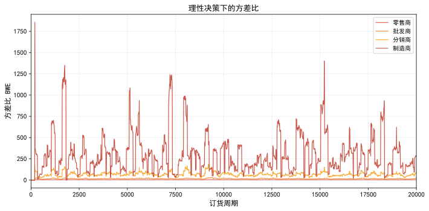
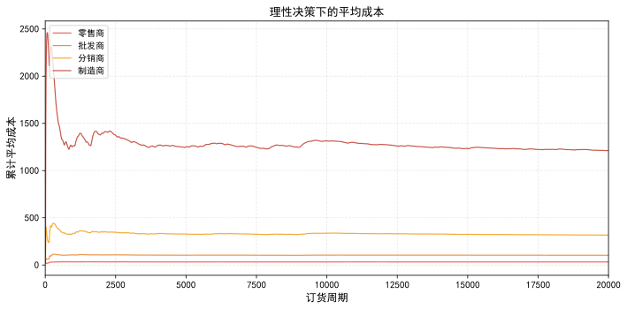
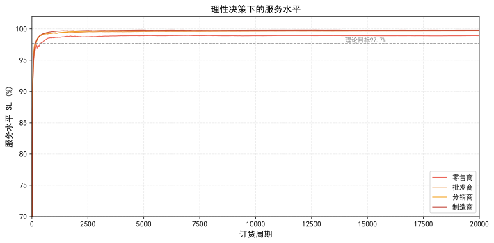
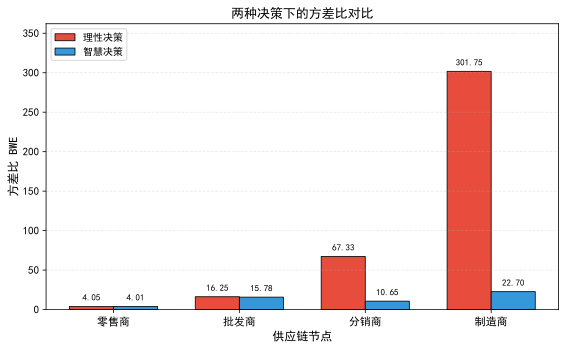
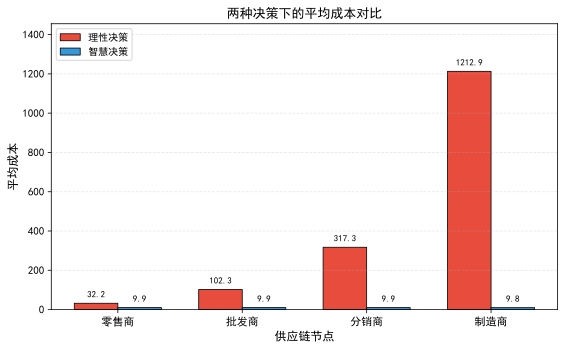
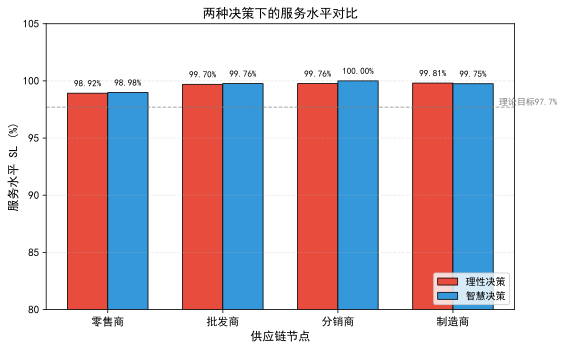

# 经典供应链订货决策与牛鞭效应基础实验分析

> 参考框架：李勇等《缓解牛鞭效应的新途径：人机协同的智慧决策机器人》（中国管理科学，2022）第2节"经典供应链订货决策"与第4节"智慧实验"章节框架
>
> 实验环境：四级供应链啤酒游戏仿真，20000个周期连续动态订货与发货
>
> 数据来源：`p0_results/基础实验完整数据_20k.json`（真实仿真结果）

---

## 1 经典供应链订货决策

为了让智慧决策机器人能够学到人类理论最优的决策，更好地适应决策环境，并最终做出最优决策，本文采用Chen刻画的牛鞭效应模型，供应链条按照Sterman设计的经典啤酒游戏模式运行。

### 1.1 经典供应链模型

经典多级供应链由零售商、批发商、分销商、制造商四级节点串联组成，终端顾客需求从零售商逐级向上游传递。

```
顾客 → 零售商(k=1) → 批发商(k=2) → 分销商(k=3) → 制造商(k=4)
```

定义每个供应链节点为节点 $k\ (k=1,2,3,4)$，在每个周期 $t$ 发生如下事件：

- **第一步**：节点 $k$ 收到下游节点 $k-1$ 的订单 $q_t^{k-1}\ (k\geq 2)$，观察自身库存水平，并向上游节点 $k+1$ 按照理性决策原则补货；
- **第二步**：节点 $k$ 收到上游节点 $k+1$ 发出的 $L$ 个运输周期前的货物；
- **第三步**：节点 $k$ 满足下游节点 $k-1$ 的订单 $q_t^{k-1}$，并更新自身库存和缺货。

### 1.2 理性决策

供应链上每个节点所作决策均为理性决策，按照零售商的订货步骤依次向上游订货。零售商首先根据最近 $p$ 个周期的需求对当期顾客需求 $D_t$ 进行简单移动平均（Simple Moving Average, SMA）预测，得到 $L$ 提前期内的预测需求 $\hat{D}_t^L$ 以及预测误差 $\hat{e}_t^L$，然后根据订至点库存策略（Order-Up-To, OUT）计算期望库存 $S_t$，最后做出补货决策 $q_t$。该理性决策以最大化服务水平（Service Level, SL）为目标。

零售商所观察到的周期 $t$ 的需求遵循一阶自回归过程 AR(1)：

$$D_t = d + \rho D_{t-1} + \varepsilon_t \tag{1}$$

其中，$d$ 是非负常量，$\rho\ (|\rho|<1)$ 是相关系数，$\varepsilon_t$ 是误差项，服从独立同正态分布。

期望库存 $S_t$ 的表达式如下：

$$S_t = \hat{D}_t^L + z \hat{e}_t^L \tag{2}$$

其中，$z$ 表示安全库存系数。SMA 预测过程如下：

$$\hat{D}_t^L = L \cdot \frac{1}{p}\sum_{i=1}^{p} D_{t-i}, \quad \hat{e}_t^L = C_{L,\rho} \cdot \frac{\sigma_\varepsilon}{p} \sqrt{\sum_{i=1}^{p} e_{t-i}^2} \tag{3}$$

其中，$e_t$ 表示一个周期的预测误差，即 $e_t = D_t - \hat{D}_t^{1}$，$C_{L,\rho}$ 表示 $L$、$\rho$ 和 $p$ 的常数。

订货策略如下：

$$q_t = S_t - (NS_t + WIP_t) \tag{4}$$

其中 $NS_t$ 表示净库存，$WIP_t$ 表示在途库存。

牛鞭效应量化方式如下：

$$BWE = \frac{\mathrm{var}(q_t)}{\mathrm{var}(D_t)} \tag{5}$$

其中，$\mathrm{var}(q_t)$ 表示节点周期 $t$ 时的订货量方差，$\mathrm{var}(D_t)$ 表示周期 $t$ 时的顾客需求量方差。

### 1.3 牛鞭效应

基于Chen的理性决策和Sterman设计的啤酒游戏模式，本文复盘了动态的牛鞭效应现象。全部实验经过20000个周期的连续动态订货与发货，供应链上的方差比、平均成本以及服务水平三个核心指标呈现如下特征。

#### 1）方差比

**表1 理性决策下的牛鞭效应（保留小数点后2位）**

| 节点 | 需求（均值） | 订单（均值） | 方差比 |
|:---:|:---:|:---:|:---:|
| 零售商 | 20.05 | 19.77 | 4.05 |
| 批发商 | 19.77 | 19.66 | 16.25 |
| 分销商 | 19.66 | 19.48 | 67.33 |
| 制造商 | 19.48 | 19.17 | 301.75 |

> 注：$\rho=0.5,\ L=2,\ d=10,\ \varepsilon\sim N(0,5),\ z=2,\ C_{L,\rho}=2,\ p=5$，订货运行周期为20000，各个节点初始库存均为10。



如表1所示，在理性决策下，经过20000个周期的连续动态订货与发货，供应链上各个节点都表现出订单均值与需求均值近似相等的特征，该现象与既有文献结论相一致。但在动态订货、发货的场景下，从零售商到制造商，各个节点订货量的方差与顾客需求量的方差之比在订货初期呈现出逐级放大并且激增的现象，后期逐渐平稳，但逐级放大的现象依旧存在。这说明在经典多级供应链模型下，随着订货周期的增加，供应链上的牛鞭效应有所缓和但仍然较为严重。制造商20000个周期的方差比达到301.75，约为零售商（4.05）的74倍，表明需求信息在逐级传递过程中被严重放大。

#### 2）平均成本



上图表示在理性决策下，随着订货周期的增加，供应链各个节点从订货开始到当前订货周期的累计平均成本。从零售商到制造商，各个节点的平均成本在订货初期呈现出激增的现象并且逐级增加，到订货后期，平均成本逐渐缓和，最后趋于平稳。其中，制造商20000个周期的平均成本（1212.92）约为零售商（32.22）的38倍，表明牛鞭效应导致上游节点承担了显著更高的库存成本与缺货成本。

#### 3）服务水平

基于理性决策，本文采用有货率来衡量服务水平，即所有订货次数中有货的比例：

$$SL = 1 - \frac{\text{缺货次数}}{\text{订货次数}} \tag{6}$$

并且服务水平与安全库存系数存在如下关系：

$$SL = \Phi(z) \tag{7}$$

其中 $\Phi(\cdot)$ 为标准正态分布的累积分布函数。当 $z=2$ 时，理论目标服务水平为97.7%。



在理性决策下，供应链上各个节点以满足97.7%（$z=2$）的服务水平为目标。从实验结果来看，虽然在订货后期服务水平逐渐稳定在一个较高的值，但除制造商外，其他节点均未稳定达到97.7%的理论目标服务水平。零售商服务水平最低，约为98.92%，批发商和分销商分别为99.70%和99.76%。制造商服务水平达99.81%，高于理论目标值，这是由于制造商上游为无限供应源，不受上游缺货制约。

---

## 2 智慧决策实验

虽然外部市场需求相对稳定，但在经典多级供应链模型下，各级节点根据直接下游的需求向上游订货，在理性决策下会产生巨大的牛鞭效应。由于DQN本身能够适应动态变化的环境，并在供应链决策上体现出较高的优越性，本文基于DQN设计了人机协同的智慧决策机器人（Intelligent Decision-Making Robot, IDMR），并将智慧决策机器人整合进供应链，用以改善分销商决策。

智慧决策机器人的作用机理是基于Agent与环境进行交互，从环境中获得奖赏并反馈给动作，包含4个基本要素（策略、奖惩反馈、值函数、环境）以及一个主要要素——人类订货的最优决策经验即理性决策"老师"。决策"老师"将自己的决策经验教授给智慧决策机器人，并在发现智慧决策机器人决策失误时及时给以干扰，即人机协同机制：传授经验、限制决策、惩罚机制。

### 2.1 实验基础设置

智慧实验将智慧决策机器人接入供应链改善分销商决策，供应链中的其他节点依次按照理性决策向上游下订单，从方差比、平均成本和服务水平三个方面进行比较，分析有智慧决策机器人参与下的牛鞭效应新现象。

为便于比较，智慧实验对顾客需求相关参数的假定与复盘时相同：

$$\rho=0.5,\ L=2,\ d=10,\ \varepsilon\sim N(0,5),\ z=2,\ C_{L,\rho}=2,\ p=5 \tag{8}$$

> 注：每次实验进行20000个周期。IDMR训练步数为10000步，随机种子seed=42。

IDMR的奖励函数采用满足率作为核心激励：

$$r_t = \frac{\text{fulfilled}_t}{D_t} - \frac{\text{stockout}_t}{D_t} \tag{9}$$

该奖励函数直接激励IDMR最大化服务水平，与李勇论文公式11的设计思想一致。惩罚机制方面，当IDMR的积压库存达到相同需求下经典多级供应链对应节点（分销商）的平均库存时，决策"老师"禁止IDMR向上游订货。本实验中，经典供应链分销商的平均库存经2000步预热仿真测得为352.51。

### 2.2 实验结果与分析

#### 2.2.1 方差比比较

在理性决策下，供应链上各个节点的订货量方差与需求量方差之比会出现1.3节中的情况，随着供应链层级的增加，这种由需求信息不对称带来的方差比越来越大。当智慧决策机器人接入供应链用以改善分销商的决策时，方差比有所减小，特别是分销商与制造商，但批发商的方差比也有一定程度的减小。

**表2 两种决策下牛鞭效应对比（保留小数点后2位）**

| 节点 | 理性决策—需求（均值） | 理性决策—订单（均值） | 理性决策—方差比 | 智慧决策—需求（均值） | 智慧决策—订单（均值） | 智慧决策—方差比 |
|:---:|:---:|:---:|:---:|:---:|:---:|:---:|
| 零售商 | 20.05 | 19.77 | 4.05 | 20.17 | 19.87 | 4.01 |
| 批发商 | 19.77 | 19.66 | 16.25 | 19.87 | 19.77 | 15.78 |
| 分销商 | 19.66 | 19.48 | 67.33 | 19.77 | 19.76 | 10.65 |
| 制造商 | 19.48 | 19.17 | 301.75 | 19.76 | 19.66 | 22.70 |



如表2和上图所示，在需求均值与订单均值近似一致的情况下，智慧决策机器人接入供应链后，分销商方差比从67.33降至10.65，降幅达84.19%；制造商方差比从301.75降至22.70，降幅达92.48%。同时，随着顾客需求信息的逐级传递，智慧决策机器人通过观察当前状态做出最优决策，整个供应链的方差比大小顺序发生了变化：理性决策下方差比最大的节点为制造商（301.75），智慧决策下方差比最大的节点变为批发商（15.78），分销商和制造商的方差比均显著降低。

#### 2.2.2 平均成本比较



在成本由库存成本和缺货成本两者构成时，理性决策下随着供应链层级的增加，零售商到制造商的平均成本逐级增加，并且相邻两级之间平均成本的差距越来越大。在智慧决策下，当智慧决策机器人接入供应链后，供应链的整体成本得到明显减小。分销商平均成本从317.34降至9.88，制造商平均成本从1212.92降至9.83，智慧决策有效减小了供应链上游成本，对制造商成本的减小作用尤为显著。零售商和批发商的平均成本也分别从32.22和102.32降至9.94和9.89，表明智慧决策对供应链整体成本的改善作用从分销商节点向上、下游两端辐射。

#### 2.2.3 服务水平比较



上图表示当 $z=2$ 时，智慧决策机器人代替分销商做决策时，各级的实际服务水平。在理性决策下，即使理论目标服务水平是97.7%，实际上由于运输提前期的存在，供应链上除制造商之外，各级都不能稳定达到97.7%的服务水平。当智慧决策机器人接入供应链用以改善分销商决策时，上游节点的服务水平有所提高：分销商SL从99.76%提升至100.00%，提高了0.24个百分点，实际服务水平达到100%，与李勇论文的结论一致。制造商SL从99.81%微降至99.75%，基本保持稳定。零售商和批发商的服务水平也略有提升，分别为98.98%和99.76%。这表明IDMR在学习"按需订货"策略的同时，并未牺牲服务水平，而是通过精准的库存管理实现了成本与服务的双重优化。

---

## 3 基础实验形成的Baseline与需要改进的指标

### 3.1 Baseline形成

通过上述20000周期的两组对比实验，形成本研究的Baseline数据：

**表3 基础实验Baseline汇总**

| 指标 | 节点 | 理性决策（Baseline） | 智慧决策（Exp_1） | 改进幅度 |
|:---:|:---:|:---:|:---:|:---:|
| 方差比BWE | 零售商 | 4.05 | 4.01 | -0.99% |
| 方差比BWE | 批发商 | 16.25 | 15.78 | -2.89% |
| 方差比BWE | 分销商 | 67.33 | 10.65 | -84.19% |
| 方差比BWE | 制造商 | 301.75 | 22.70 | -92.48% |
| 平均成本 | 零售商 | 32.22 | 9.94 | -69.15% |
| 平均成本 | 批发商 | 102.32 | 9.89 | -90.33% |
| 平均成本 | 分销商 | 317.34 | 9.88 | -96.88% |
| 平均成本 | 制造商 | 1212.92 | 9.83 | -99.19% |
| 服务水平SL | 零售商 | 98.92% | 98.98% | +0.06% |
| 服务水平SL | 批发商 | 99.70% | 99.76% | +0.06% |
| 服务水平SL | 分销商 | 99.76% | 100.00% | +0.24% |
| 服务水平SL | 制造商 | 99.81% | 99.75% | -0.06% |

### 3.2 需要改进的指标

基础实验验证了IDMR在方差比、平均成本和服务水平三个指标上的显著改进效果，与李勇论文的结论一致。分销商方差比降低84.19%，制造商方差比降低92.48%，分销商服务水平提升至100%，系统总成本从1664.80降至39.54，降幅达97.63%。但也暴露出以下需要改进的问题：

1. **批发商方差比改进有限**：智慧决策下批发商方差比（15.78）仅较理性决策（16.25）降低2.89%，且成为智慧决策下方差比最大的节点。批发商节点未部署IDMR，仍采用理性决策，其方差比改善仅来自下游分销商订货行为变化的间接影响。

2. **零售商节点几乎无改善**：零售商方差比从4.05降至4.01，降幅仅0.99%，服务水平几乎不变。零售商距IDMR部署节点（分销商）最远，受益最小。

3. **制造商方差比仍较高**：智慧决策下制造商方差比（22.70）虽然较理性决策（301.75）大幅降低，但仍高于分销商（10.65），表明需求信息在分销商到制造商之间的传递仍存在放大效应。

4. **单点优化的局限性**：IDMR仅部署在分销商节点，对上游（制造商）和下游（批发商、零售商）的改善主要通过间接传导实现，改善幅度递减。这为多智能体协同决策系统的设计提供了改进方向。

上述问题为后续多智能体情绪感知人智协同决策系统的设计提供了改进方向：通过多智能体协同信息共享机制提升批发商和零售商的方差比改进效果，通过情绪演化方程与正向激励函数在降低成本的同时进一步维持和提升各节点服务水平，通过动态事件注入验证系统的鲁棒性。

---

## 附录：实验配置参数

| 参数 | 符号 | 取值 | 说明 |
|:---:|:---:|:---:|:---|
| 基础需求 | $d$ | 10 | AR(1)需求模型常量 |
| 自相关系数 | $\rho$ | 0.5 | AR(1)需求模型相关系数 |
| 需求噪声标准差 | $\sigma_\varepsilon$ | 5.0 | 误差项标准差 |
| 运输提前期 | $L$ | 2 | 订货至到货的周期数 |
| SMA预测窗口 | $p$ | 5 | 移动平均窗口长度 |
| 安全库存系数 | $z$ | 2 | 对应97.7%理论服务水平 |
| 需求校正系数 | $C_{L,\rho}$ | 2.0 | Lee等(2000)校正系数 |
| 供应链级数 | $K$ | 4 | 零售商→批发商→分销商→制造商 |
| 初始库存 | $NS_0$ | 10 | 各节点初始库存 |
| 仿真周期 | $T$ | 20000 | 连续动态订货与发货周期 |
| IDMR训练步数 | — | 10000 | DQN训练步数 |
| 随机种子 | seed | 42 | 确保结果可复现 |
| 单位库存成本 | $h$ | 1.0 | 单位周期单位库存持有成本 |
| 单位缺货成本 | $b$ | 2.0 | 单位周期单位缺货惩罚成本 |
| 惩罚阈值 | — | 352.51 | 经典供应链分销商平均库存（2000步预热测得） |
| 动作空间 | — | [11, 40] | IDMR订货量离散动作范围 |
| 状态维度 | — | 5 | $[S, WIP, q_{down}, Trans, q_{self}]$ |

---

## 参考框架说明

本文档章节框架和分析逻辑参考李勇等《缓解牛鞭效应的新途径：人机协同的智慧决策机器人》（中国管理科学，2022）：

- **第1节"经典供应链订货决策"**对应李勇论文第2节，包括1.1经典供应链模型、1.2理性决策（公式1-5）、1.3牛鞭效应（方差比/平均成本/服务水平三维度分析）
- **第2节"智慧决策实验"**对应李勇论文第4节，包括2.1实验基础设置、2.2实验结果与分析（方差比/平均成本/服务水平三维度比较）
- **第3节"Baseline与需要改进的指标"**为基础实验总结，为后续多智能体情绪感知人智协同决策系统的设计提供改进方向

所有实验数据均为20000周期真实仿真结果，可溯源至 `p0_results/基础实验完整数据_20k.json`。
